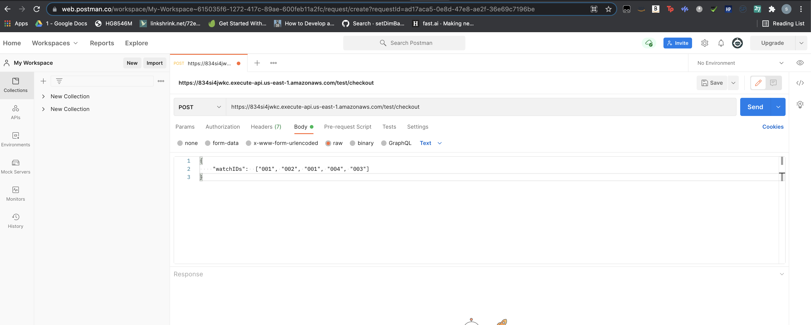

# E-commerce API to Calculate the Total Cost of Items in the Cart (Java)

This is an API service used to calculate the total cost of the items in the cart during checkout. The examples has been built with a catalog of watches and has been developed in a generic way to be extended for any other item types too.
It handles the use case of even having a discount policy for a watch in the catalog. 

The API accepts a list of watchIds and returns the total price to be paid at checkout. 
If a watch item not present in the catalog is sent in the input request, it returns the id of the watch which was not found in the catalog.
If the input is put in incorrectly, it tells the client to put in the input correctly. 

The service architecture is as follows :


#### Technology and Frameworks Used
1) `Java` - Used as the main language
2) `Dagger` - Library for Dependency Injection (Used Dagger to achieve lower latencies with AWS Lambda)
3) `Lombok` - To generate common code if annotations
4) `slf4j` - For logging in AWS CloudWatch
5) `mockito and junit` - For writing tests
6) `AWS SDK` - For Lambda and DDB interactions

1) 'AWS Lambda' - Serverless cloud compute solution to run the service
2) 'AWS API Gateway' - AWS API Gateway is used to expose the API.
3) 'AWS DynamoDB' - Used as a database for the watches or items currently available in the catalog.

#### Project Structure
The project includes function code and supporting resources:
- `src/main` - Java App code.
- `src/test` - Tests.
- `template-mvn.yml` - An AWS CloudFormation template that creates an application.
- `pom.xml` - A Maven build file.
- `1-create-bucket.sh`, `2-deploy.sh`, etc. - Shell scripts that use the AWS CLI to deploy and manage the application.

#### Assumptions 
For example and testing sake the below shown watch catalog is used in present in the DynamoDB table. Any watchID passed in the input apart from 
this table would return a `Watch not Found Response with the missing watchID`. This though is not a limitation and just for example sake, and can be easily extended by adding new items to the catalog. 


#### Future Work 
1) As of now, the catalog needs to be manually updated by adding items to the DynamoDB Catalog table via the CLI or AWS Console. An API can be developed to perform 
CREATE and UPDATE actions.

2) Caching. We can Cache the catalog item data. Since the create and update operations would be less frequent than the read operations, the data received from the catalog database can be cached to reduce latencies.

3) Re-try. Though DynamoDB is highly available, we can still add an exponential back off mechanism for retries, to make the service more fault tolerant to network related issues.

4) Throttling of client requests to protect the service. If a burst of requests come in, we should have time to auto-scale and the service should not go down. To optimize cost, the Lambda is running on provisioned concurrency and not on demand.

5) Authentication to control which clients can call this API.

6) Schema can be extended to keep a count of how much quantity of each item is present in the inventory.

## Testing 
The application is already hosted in my AWS account and exposed with the following end point. It can be easily tested using any of the standard ways like `Postman` or the `curl command`

```
https://834si4jwkc.execute-api.us-east-1.amazonaws.com/test/checkout
```

### Testing Using Postman
1) Sign-in to the Postman website : https://www.postman.com/
2) Go to `My Workspace` and create a new `HTTP Request`
3) Choose the action as `POST` and enter the API url from above to invoke the function.
4) In the request  `Body`, pass a `JSON as shown below` with the required watchIds for which the total checkout cost needs to be calculated.

Note : As mentioned above, for functionality testing, the catalog contains only watchIds : "001", "002", "003" and "004" currently.

```
{
    "watchIDs":  ["001", "002", "001", "004", "003"]
}
```

5) The final request skeleton should look as below. Once everything is set. Send the request.



6) You would receive the total price to paid as shown below :


#### Exception Use Cases

a) If Watch is Not present in the catalog. It returns the 'id of the watch' not present in the catalog as shown below. We input `'005'` which is currently not present.  


  
b) If the JSON input sent is incorrect and not as shown in `step 4` we get a notification as shown below. 


### Testing Using Curl 
Alternatively, the above API end point can be invoked using the curl command too. The same cases apply as above.

Sample command :

```
curl -v -X POST \
'https://834si4jwkc.execute-api.us-east-1.amazonaws.com/test/checkout' \
-H 'content-type: application/json' \
-d '{"watchIDs":  ["001", "002", "001", "004", "003"]}'
```


## Deploy Application to an AWS Account

If you want to tweak the application and deploy it in your own AWS account, follow the below instructions.
#### Requirements
- [Java 8 runtime environment (SE JRE)](https://www.oracle.com/java/technologies/javase-downloads.html)
- [Maven 3](https://maven.apache.org/docs/history.html)
- [The AWS CLI](https://docs.aws.amazon.com/cli/latest/userguide/cli-chap-install.html) v1.17 or newer.

If you use the AWS CLI v2, add the following to your [configuration file](https://docs.aws.amazon.com/cli/latest/userguide/cli-configure-files.html) (`~/.aws/config`):

```
cli_binary_format=raw-in-base64-out
```

This setting enables the AWS CLI v2 to load JSON events from a file, matching the v1 behavior.

#### Setup
Download or clone this repository.

    $ git clone https://github.com/savarmehrotra/TotalCheckoutCostAPI.git
    $ cd TotalCheckoutCostAPI

Run `1-create-bucket.sh` to create a new bucket for deployment artifacts.

    TotalCheckoutCostAPI$ ./1-create-bucket.sh
    make_bucket: lambda-artifacts-a5e4xmplb5b22e0d

#### Deploy
Run `2-deploy.sh` to build the application with Gradle and deploy it.

    TotalCheckoutCostAPI$ ./2-deploy.sh
    BUILD SUCCESSFUL in 1s
    Successfully packaged artifacts and wrote output template to file out.yml.
    Waiting for changeset to be created..
    Successfully created/updated stack - total-checkout-cost-api

This script uses AWS CloudFormation to deploy the Lambda functions and an IAM role. If the AWS CloudFormation stack that contains the resources already exists, the script updates it with any changes to the template or function code.

    
#### Cleanup
To delete the application, run `3-cleanup.sh`.

    TotalCheckoutCostAPI$ ./4-cleanup.sh